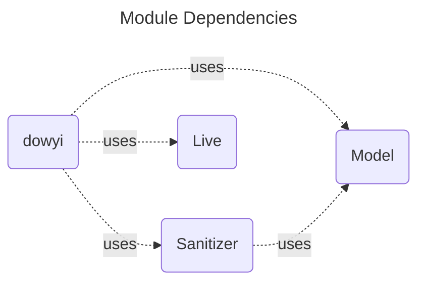
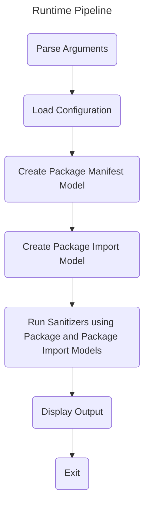

# Architecture

## Modules

| Name      | Type       | Purpose                                        |
|-----------|------------|------------------------------------------------|
| `dowyi`     | Executable | Main entry, glues together all other libraries |
| `Model`     | Library    | Models for Package, Imports, and Configuration |
| `Sanitizer` | Library    | Sanitizers for validating Package manifest     |
| `Utility`   | Library    | Lightweight helpers                            |
| `Live`      | Library    | Heavyweight "live" dependencies                |

### Notes

- `Utility` contains lightweight extensions and types
- `Live` contains heavyweight types that in turn depend on "live" dependencies
  such as `Process`, `FileManager` that need to be abstracted away for testing

## Module Dependencies

### Notes

- All modules are free to depend on `Utility` hence it is omitted above

## Pipeline

## Key Implementation Details

- The model of the Swift Package Manifest is derived from the Swift driver's
[dump-package
command](https://github.com/apple/swift-package-manager/blob/main/Sources/PackageModel/Manifest/Manifest.swift#L526)
- this requires that a Swift toolchain is installed
